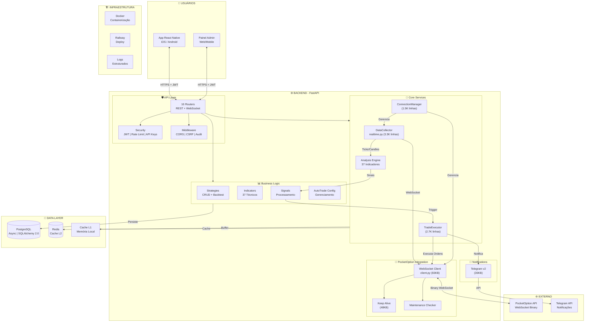
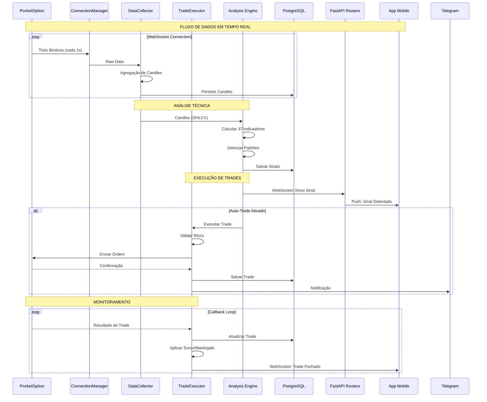
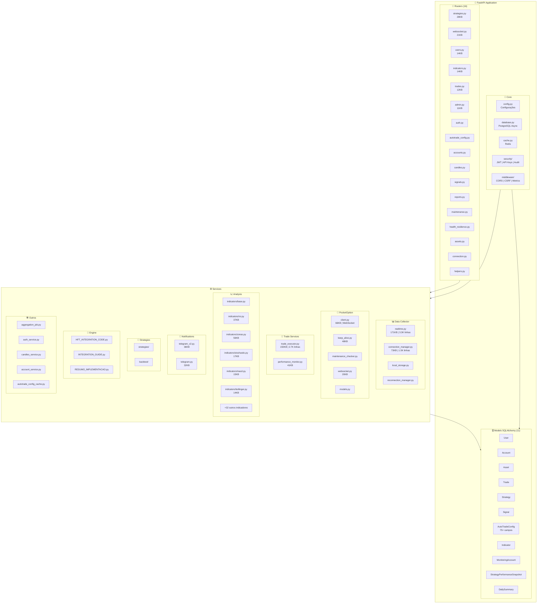
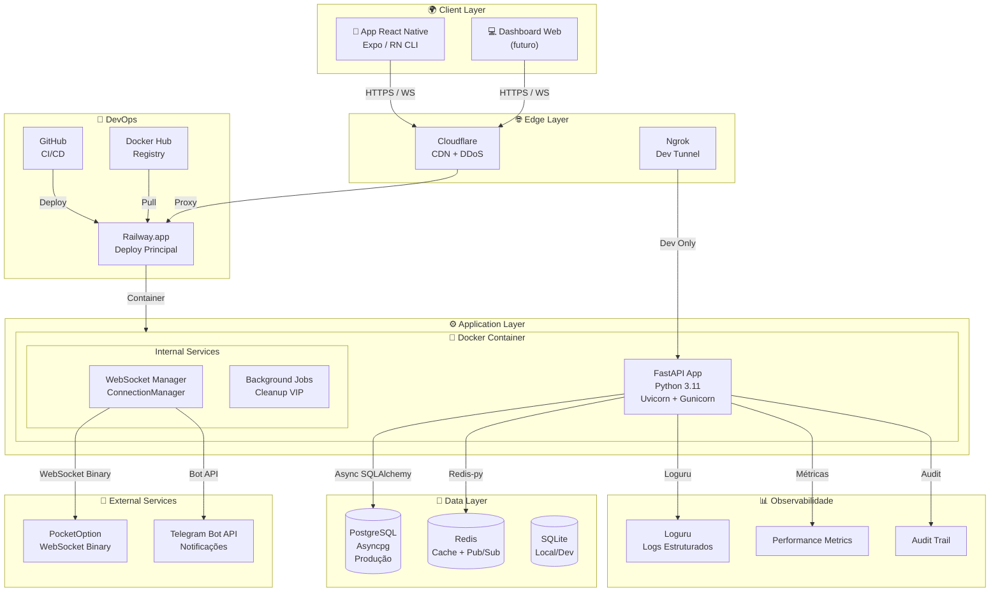
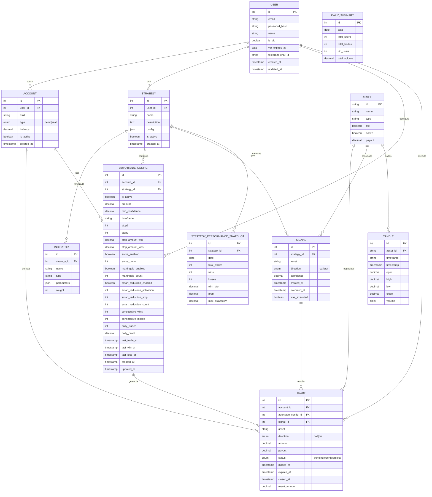
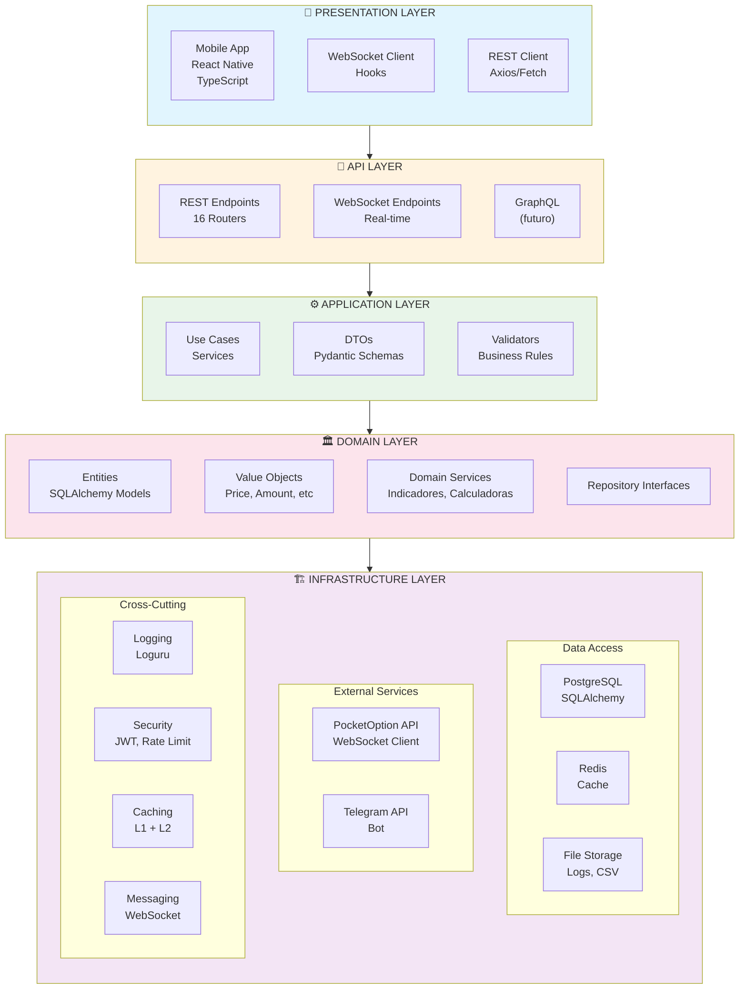

# Diagrama Arquitetural Completo - TunesTrade

> Diagrama em formato Mermaid. Para visualizar:
> - Use: https://mermaid.live
> - Ou extensão Mermaid no VS Code
> - Ou GitHub (renderiza automaticamente)

## 1. Diagrama de Arquitetura de Alto Nível



---

## 2. Diagrama de Fluxo de Dados (Data Flow)



---

## 3. Diagrama de Componentes do Backend



---

## 4. Diagrama de Deploy/Infraestrutura



---

## 5. Diagrama de Entidades de Banco de Dados



---

## 6. Diagrama de Camadas (Layered Architecture)



---

## Como Usar

1. **Copie qualquer diagrama** acima (tudo entre as tags ```mermaid)
2. **Cole em:** https://mermaid.live
3. Ou use a **extensão Mermaid** no VS Code
4. Ou salve como `.md` no GitHub (renderiza automaticamente)

---

**Gerado em:** Março 2026  
**Versão:** 1.0  
**Projeto:** TunesTrade AutoTrade System
